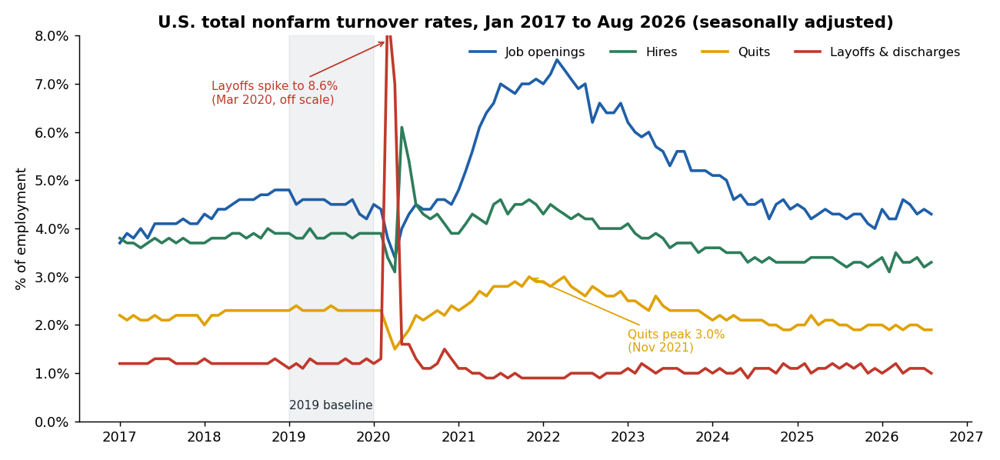
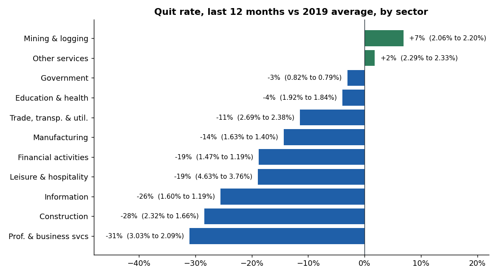
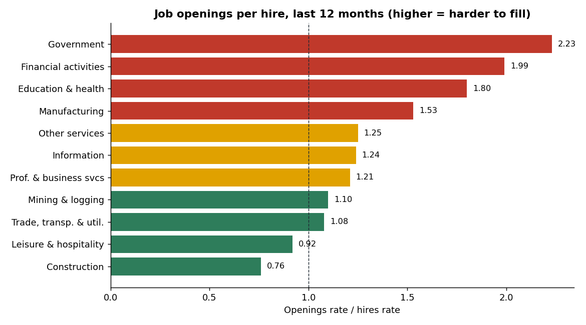
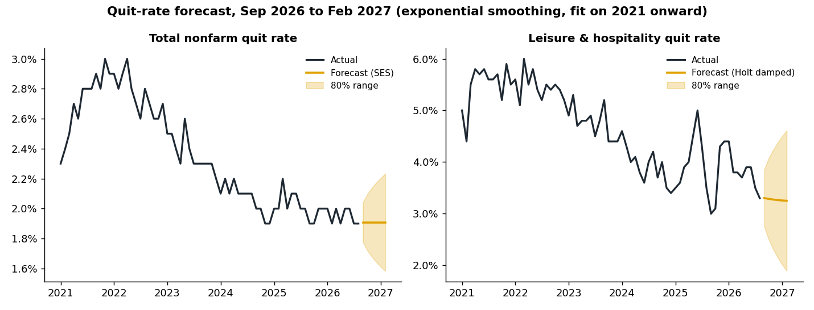

# Workforce Turnover Analysis and Forecast (BLS JOLTS)

How has U.S. worker turnover changed since the "Great Resignation", which industries are
hardest to hire for, and where is the quit rate heading?

This project pulls monthly **Job Openings and Labor Turnover Survey (JOLTS)** data from the
U.S. Bureau of Labor Statistics API (job openings, hires, quits, and layoffs for total nonfarm,
total private and 11 sectors, Jan 2017 to Aug 2026), checks it, compares today with the 2019
baseline and the 2022 peak, forecasts quit rates with exponential smoothing, and exports a
star schema for a Power BI dashboard.

**Tools:** Python (pandas, NumPy, matplotlib, requests), BLS Public Data API v2, Power BI (DAX)



## Results

Data through **August 2026** (52 seasonally adjusted series, 116 months each, 6,032 observations, all 7 quality checks pass).

**1. The market has cooled below 2019, with low hiring and low quitting.**
Over the last 12 months, compared with the 2019 average for total nonfarm:

| Rate | 2019 avg | 2022 avg | Last 12 months | vs 2019 |
|---|---|---|---|---|
| Job openings | 4.52% | 6.85% | 4.30% | -5% |
| Hires | 3.87% | 4.20% | 3.30% | -15% |
| Quits | 2.32% | 2.76% | 1.95% | -16% |
| Layoffs & discharges | 1.21% | 0.96% | 1.08% | -10% |

Quits peaked at **3.0% in Nov 2021** and openings at **7.5% in Mar 2022**. Since then the quit rate has
been flat at 1.9-2.0% for over a year. Workers are staying put, and employers are hiring less without
laying off more.

**2. Quits fell most in white-collar sectors.** Professional and business services fell -31% (3.03% to 2.09%),
construction -28%, and information -26%. Mining and logging (+7%) and other services (+2%) are the only
sectors above 2019.



**3. Information is the only sector with clearly higher layoffs than 2019** (1.35% to 1.60%, +0.25 pts).
Professional and business services (+0.06) and education and health (+0.03) are about flat.

**4. Openings are hardest to fill in government, finance and healthcare.** Government posts 2.23 openings
for every hire, financial activities 1.99, and education and health 1.80. Construction (0.76) and leisure and
hospitality (0.92) fill openings faster than they post them.



**5. Forecast: the quit rate stays near 1.9% through Feb 2027.** Simple exponential smoothing projects the
total nonfarm quit rate at **1.91%** (80% range 1.58-2.23% by Feb 2027). Leisure and hospitality, the
highest-turnover sector, is projected to drift down to about 3.25%.



**How good is the forecast?** Each series was backtested on its last 12 months. The better of SES and
damped Holt beat a naive "last value" forecast in **7 of 13** series (for example construction, education and
health, and professional and business services). For total nonfarm, the naive forecast was slightly better
(MAE 0.050 vs 0.059 pts), because the series has been flat and BLS rounds rates to 0.1. The takeaway is
that the quit rate is stable rather than heading to a new turn.

**Recommendation for an HR or workforce-planning team:** with quits about 16% below 2019, budget for lower
backfill volume and redirect recruiting effort to roles in hard-to-fill areas (openings per hire above 1.5),
and watch information-sector layoffs, the only sector clearly above its 2019 level.

## How it works

```
BLS API  ->  data/raw/*.csv  ->  tidy + quality checks  ->  analysis tables
                                                       ->  quit-rate forecasts (SES / damped Holt + backtest)
                                                       ->  outputs/powerbi/ star schema  ->  Power BI
```

* **Fetch** (`jolts/fetch.py`): posts the 52 series IDs to the BLS v2 API in batches of 25 (the keyless
  limit), drops annual averages and missing values. Set `BLS_API_KEY` for a free registered key.
* **Checks** (`jolts/transform.py`): missing series, uneven month counts, gaps in a monthly series, missing
  values, negative or impossible rates, and unknown industry codes. The build stops if any check fails.
* **Analysis** (`jolts/analysis.py`): 2019 vs 2022 vs latest 12 months for every industry and rate,
  peaks, quits share of separations, and openings per hire.
* **Forecast** (`jolts/forecast.py`): SES and damped-trend Holt written in NumPy, parameters picked by grid
  search on one-step error, model picked on a 12-month holdout, 6-month forecast with an 80% range. Models
  are fit on 2021 onward so the 2020 shock does not distort the trend.

## Run it

```bash
pip install -r requirements.txt
python -m jolts fetch          # optional: refresh data/raw from the BLS API
python -m jolts build          # checks, analysis, forecasts, Power BI feed -> outputs/
python scripts/make_charts.py  # README charts -> docs/
pytest                         # 11 tests
```

The raw extract used for the results above is included in `data/raw/`, so `build` works offline.

## Power BI

`outputs/powerbi/` holds two fact tables and three dimensions. `powerbi/measures.dax` has the measures
(rates, 2019 baseline, latest 12 months, change vs 2019, openings per hire, quits share, forecast band), and
`powerbi/README.md` explains the model and report pages.

## Project structure

```
jolts/
  series.py      series IDs, industry and measure names
  fetch.py       BLS API client
  transform.py   tidy table and data quality checks
  analysis.py    period comparison, peaks, sector churn
  forecast.py    SES, damped Holt, backtest
  build.py       runs everything and writes outputs/
data/raw/        BLS extract (Jan 2017 - Aug 2026)
outputs/         analysis CSVs, summary.md, powerbi/ feed
powerbi/         DAX measures and model notes
scripts/         chart builder
docs/            charts used in this README
tests/           unit tests and a full build on the real data
```

## Data source

U.S. Bureau of Labor Statistics, Job Openings and Labor Turnover Survey, seasonally adjusted national rates
(series `JTS{industry}000000000{JO|HI|QU|LD}R`). Rates are a percentage of employment (openings: of
employment plus openings). Public domain. Recent months are preliminary and BLS revises them.

## License

MIT
